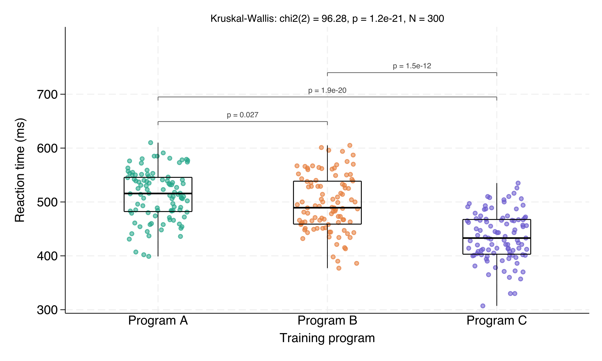
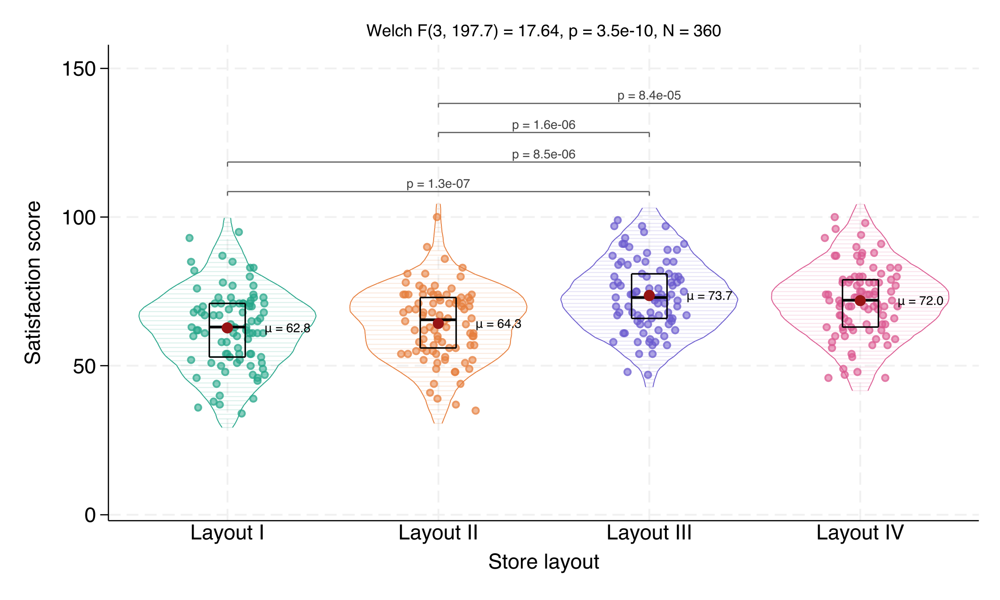
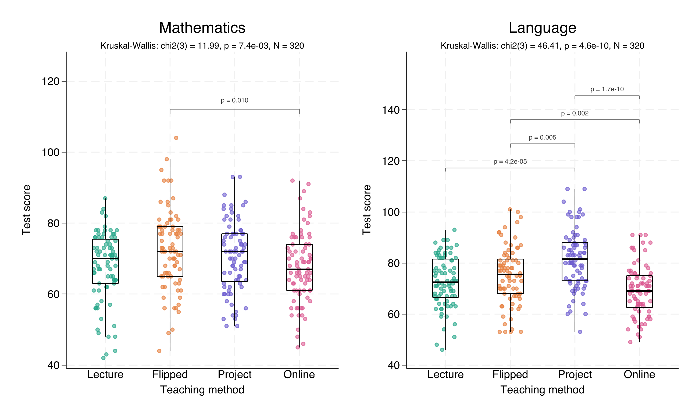
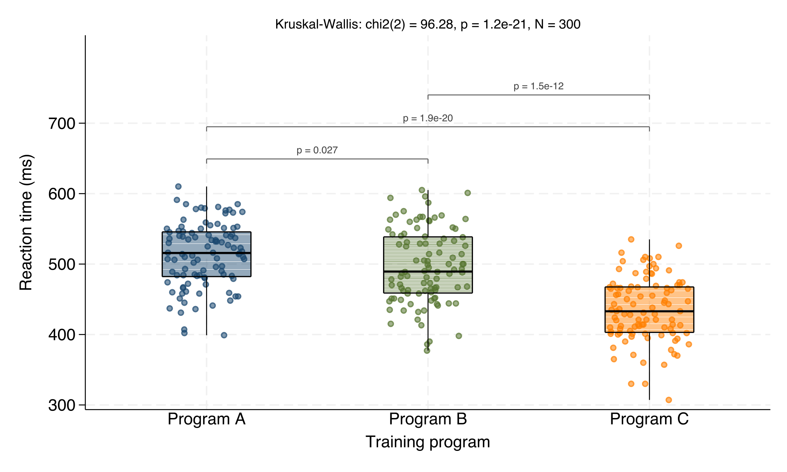

# betweenstats

A Stata command that draws a **between-groups comparison plot** in the style of
R's `ggstatsplot::ggbetweenstats`: a **box or violin** for each group with
jittered raw data points, an **overall test** in the header, and
**pairwise-comparison brackets** (Holm-adjusted) at the top.

Two test families are built in — no external packages required:

- **np** — Kruskal-Wallis omnibus + Dunn pairwise (rank-based; default)
- **param** — Welch ANOVA omnibus + Games-Howell pairwise (unequal variances)

## Two ready-made styles

**Style 1 — box + Kruskal-Wallis / Dunn** (nonparametric)

```stata
use "https://raw.githubusercontent.com/ganma0517/stata_betweenstats/main/betweenstats_demo.dta", clear
betweenstats score, by(group) type(box) test(np)
```



**Style 2 — violin + Welch / Games-Howell + means** (parametric)

```stata
use "https://raw.githubusercontent.com/ganma0517/stata_betweenstats/main/betweenstats_demo2.dta", clear
betweenstats sat, by(layout) type(violin) test(param) means
```



**Style 3 — faceted by a panel variable** (`panel()`)

Draw one sub-plot per level of another variable and combine them — ideal for
comparing the same grouping across markers, subjects, time points, etc.

```stata
use "https://raw.githubusercontent.com/ganma0517/stata_betweenstats/main/betweenstats_demo3.dta", clear
betweenstats score, by(method) panel(subject)

* add ycommon for a shared y-axis across panels (easier to compare)
betweenstats score, by(method) panel(subject) ycommon
```



## Colour each group — `bycolors()`

Assign specific groups their own colour with `value=colour` pairs. The key is the
group's value label, or its raw value (use the raw value when the label contains
spaces). Groups you don't list keep their default palette colour. Works with box,
violin, and `boxfill`.

```stata
betweenstats score, by(group) type(box) boxfill ///
    bycolors(1=navy 2=forest_green 3=orange)
```



## Requirements

- Stata 16 or newer

## Installation

### Option A — `net install` (recommended)

```stata
net install betweenstats, from("https://raw.githubusercontent.com/ganma0517/stata_betweenstats/main/") replace
```

### Option B — `github install`

Requires the community `github` command (`ssc install github` once), then:

```stata
github install ganma0517/stata_betweenstats
```

After installing, read the help and run the example:

```stata
help betweenstats
do betweenstats_example.do
```

## Quick start

A practice dataset is included — **fictional** reaction times (ms) under three
imaginary training programs (no real-world source). Load it directly from the
repo (no install needed):

```stata
use "https://raw.githubusercontent.com/ganma0517/stata_betweenstats/main/betweenstats_demo.dta", clear
betweenstats score, by(group)
```

## Syntax

```
betweenstats yvar [if] [in], by(groupvar) [options]
```

| Option | Description | Default |
|---|---|---|
| `by(varname)` | grouping variable (required) | — |
| `type()` | `box` or `violin` | box |
| `test()` | `np` (KW+Dunn) or `param` (Welch+Games-Howell) | np |
| `alpha(#)` | threshold to show a bracket | 0.05 |
| `showns` | also show non-significant brackets | off |
| `means` | add mean dot + μ label | off |
| `meancolor()` | mean-dot color | dark red |
| `boxfill` | fill each box with its group colour | off |
| `panel(varname)` | facet: one sub-plot per level | — |
| `cols(#)` | columns when faceting | auto |
| `ycommon` | shared y-axis across panels | off |
| `nopoints` `jitter()` `msize()` | raw-point controls | — |
| `palette()` | R G B triples, one per group | built-in |
| `bycolors()` | explicit colour per group, e.g. `bycolors(1=navy 2=forest_green)` (alias `colors()`) | — |
| `title()` `ytitle()` `xtitle()` | titles | variable labels |
| `saving()` `name()` | export / window name | — |

See `help betweenstats` for full documentation and examples.

## Notes on the statistics

All pairwise p-values use Holm correction. Very small p-values are shown in
scientific notation, reconstructed from the log scale to avoid numeric underflow.
The Dunn test includes a tie correction; Games-Howell uses Welch-type degrees of
freedom. Results are intended for visualization and should match standard
implementations closely, but for formal inference please confirm with a
dedicated procedure.

## Files

- `betweenstats.ado` — the command
- `betweenstats.sthlp` — Stata help file
- `betweenstats_example.do` — runnable tutorial
- `betweenstats_demo.dta` — practice data (fictional, long format)
- `example_betweenstats.png` — demo figure
- `betweenstats.pkg`, `stata.toc` — package metadata for `net install`

## About the author

I am Wen-Cheng Lin, a PhD student in the Department of Political Science at
National Chengchi University, currently serving as a postdoctoral research fellow
at the Institute of Sociology, Academia Sinica. This package is a collaboration
between me and Claude. It is still at an experimental stage and is intended mainly
for presenting results from survey-experiment and comparative designs. If you have
any questions, you are warmly welcome to get in touch — beck740517@gmail.com

我是林文正，政治大學政治學系博士生，目前在中央研究院社會學研究所擔任博士後研究員。
本套件是我與 Claude 的協作成果，目前仍屬實驗性階段，主要用於調查實驗法與比較研究的
資訊呈現。若有任何問題，歡迎寫信與我交流。

## Citation

Lin, Wen-Cheng (2026). *betweenstats: Between-groups comparison plot with overall
test and pairwise brackets.* https://github.com/ganma0517/stata_betweenstats

## License

MIT — see [LICENSE](LICENSE).
